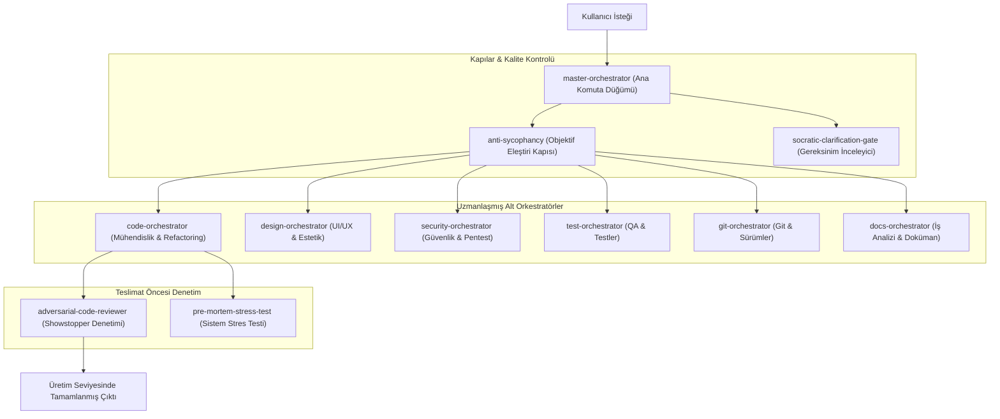

# 🧠 Evrensel AI Agent Yetenek & Kural Kütüphanesi

[Türkçe](README.md) | [English](README_EN.md)

[](LICENSE)
[](CONTRIBUTING.md)
[]()
[]()
[]()
[]()
[]()
[]()

> **Evrensel Açık Kaynak AI Agent Kütüphanesi**; **Antigravity (Gemini)**, **Cursor AI**, **Claude Code**, **GitHub Copilot**, **OpenAI Codex** ve **Windsurf** araçları için üretim seviyesi mühendislik yetenekleri, orkestratör agent'lar ve dalkavukluk önleyici (anti-sycophancy) eleştiri kuralları sunar.

---

## 🙏 Atıflar ve Teşekkürler (Acknowledgements & Credits)

Bu kütüphanenin geliştirilmesinde ilham veren ve zemin hazırlayan açık kaynak proje sahiplerine ve araştırmacılara derin teşekkürlerimizi sunarız:

- **[PatrickJS/awesome-cursorrules](https://github.com/PatrickJS/awesome-cursorrules)** - Cursor Rules ekosistemi ve anti-sycophancy kod disiplini standartları.
- **[0xcjl/anti-sycophancy](https://github.com/0xcjl/anti-sycophancy)** - 3 katmanlı anti-sycophancy savunması ve ArXiv *"Ask Don't Tell"* araştırması.
- **[addyosmani/agent-skills](https://github.com/addyosmani/agent-skills)** - Addy Osmani'nin üretim seviyesi mühendislik ilkeleri.
- **[anthropics/skills](https://github.com/anthropics/skills)** - Resmi Anthropic `SKILL.md` format standardı.
- **[SwePalm/socratic-skill](https://github.com/SwePalm/socratic-skill)** & **[m4vic/socratic](https://github.com/m4vic/socratic)** - Sokratik netleştirme kapısı.
- **[vlad-ko/claude-wizard](https://github.com/vlad-ko/claude-wizard)** - Hasmane kod incelemesi ve teslim öncesi showstopper denetimi.
- **[ColdIQ/ColdIQ-s-GTM-Skills](https://github.com/Cold-IQ/ColdIQ-s-GTM-Skills)** - Pre-Mortem sistem stres simülasyonu.
- **[mukul975/Anthropic-Cybersecurity-Skills](https://github.com/mukul975/Anthropic-Cybersecurity-Skills)** - Siber güvenlik, API testleri ve Pentest yetenek (skill) senaryoları.

Tüm detaylı atıflar için bkz: **[CREDITS.md](CREDITS.md)** | **[CREDITS_EN.md](CREDITS_EN.md)**.

---

## 🏛️ Mimari & Orkestrasyon Akışı

Bu depo, alt orkestratörleri koordine eden ve tüm LLM araçlarında objektif kod disiplinini uygulayan bir **Master Orkestratör Motoru** içerir:



### Proje Yapısı
```text
ai-skills/
├── .github/                       # GitHub templates & Copilot global instructions
│   ├── ISSUE_TEMPLATE/
│   ├── PULL_REQUEST_TEMPLATE.md
│   └── copilot-instructions.md
├── agents/                        # Agent-specific modular configurations
│   ├── antigravity/               # Antigravity (Gemini) skills
│   ├── claude-code/               # Claude Code skills
│   ├── codex/                     # OpenAI Codex skills
│   ├── copilot/                   # GitHub Copilot instructions
│   ├── cursor/                    # Cursor rules (.mdc) & skills
│   └── windsurf/                  # Windsurf / Cascade rules
├── docs/                          # Clean documentation folder
│   ├── INSTALL.md                 # Türkçe Kurulum Kılavuzu
│   ├── INSTALL_EN.md              # English Installation Guide
│   ├── CREDITS.md                 # Türkçe Atıflar & Teşekkürler
│   ├── CREDITS_EN.md              # English Acknowledgements & Credits
│   ├── CONTRIBUTING.md            # Katkıda Bulunma Rehberi
│   └── CODE_OF_CONDUCT.md         # Topluluk Kuralları
├── skills/                        # 63+ Modular AI Agent Skills (SKILL.md)
│   ├── anti-sycophancy/
│   ├── master-orchestrator/
│   ├── code-orchestrator/
│   └── ...
├── rules/                         # Compiled Cursor Rules (.mdc)
│   ├── anti-sycophancy.mdc
│   ├── master-orchestrator.mdc
│   └── ...
├── scripts/                       # Internal build & utility scripts
│   ├── build_agent_folders.py
│   ├── build_cursor_rules.py
│   └── update_skill_descriptions.py
├── AGENTS.md                      # Universal Agents definition
├── .windsurfrules                 # Windsurf / Cascade rules
├── LICENSE                        # MIT License
├── README.md                      # Varsayılan Türkçe Ana Sayfa
├── README_EN.md                    # İngilizce Ana Sayfa
└── setup.py                       # Etkileşimli Evrensel Kurulum Sihirbazı
```

---

## 🌟 Evrensel Agent Uyum Matrisi

| AI Agent / IDE | Yerel Format | Global Konum | Proje Konumu |
| :--- | :--- | :--- | :--- |
| 🟢 **Antigravity (Gemini)** | `SKILL.md` | `~/.gemini/config/skills` | `.agents/skills` |
| 🔵 **Cursor AI** | `.mdc` & `skills-cursor` | `~/.cursor/rules` & `skills-cursor` | `.cursor/rules` |
| 🟠 **Claude Code** | `SKILL.md` | `~/.claude/skills` | `.claude/skills` |
| 🟣 **GitHub Copilot** | `copilot-instructions.md` | `~/.github/copilot-instructions.md` | `.github/copilot-instructions.md` |
| 🖤 **OpenAI Codex / CLI** | `SKILL.md` & `AGENTS.md` | `~/.codex/skills` | `.codex/skills` |
| 🪟 **Windsurf / Cascade** | `.windsurfrules` | - | `.windsurfrules` |
| 🤖 **Jenerik AI Agent'lar** | `AGENTS.md` | `~/.agents/skills` | `AGENTS.md` |

---

## 🚀 Hızlı Kurulum Rehberi

Etkileşimli kurulum sihirbazı ile tüm yetenekleri tek bir komutla yükleyin:

```bash
# 1. Depoyu klonlayın
git clone https://github.com/GktuOktay/ai-skills.git
cd ai-skills

# 2. Kurulum betiğini çalıştırın (Etkileşimli Dil Seçimi: Türkçe / English)
python setup.py

# Dilerseniz dil parametresi ile doğrudan çalıştırın:
python setup.py --lang tr
python setup.py --lang en
```

Detaylı kurulum kılavuzu için bkz: **[INSTALL.md](INSTALL.md)** | **[INSTALL_EN.md](INSTALL_EN.md)**.

---

## 🤝 Katkıda Bulunma

Açık kaynak katkılarınızı bekliyoruz! Lütfen önce [Katkı Rehberi](CONTRIBUTING.md) ve [Topluluk Kurallarını](CODE_OF_CONDUCT.md) inceleyin.

---

## 📄 Lisans

Bu proje [MIT Lisansı](LICENSE) altında açık kaynaklıdır.
