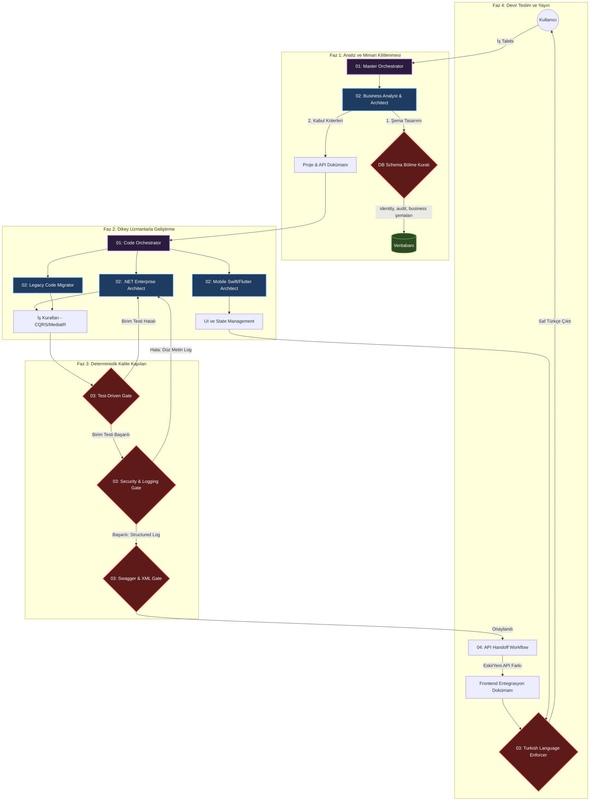

# 🚀 AI-Skills v2.0: Otonom Dijital Ajans

[English Documentation (README_EN.md)](README_EN.md)

Bu depo, standart ve pasif yapay zeka (LLM) prompt yığınlarını reddeden; yerine **karar alabilen, test yazan, birbirine iş devreden ve deterministik kalite kapılarından (Quality Gates) geçen** otonom bir ajan ekosistemidir.

## 📊 Ajan Topolojisi ve Detaylı Veri Akışı


## 📚 Kapsamlı Dokümantasyon (Türkçe)
* 🏗️ [Mimarinin Anatomisi (ARCHITECTURE.md)](docs/tr/ARCHITECTURE.md)
* 🧠 [Çekirdek Prensipler (PRINCIPLES.md)](docs/tr/PRINCIPLES.md)
* 🔄 [Otonom İş Akışları (WORKFLOWS.md)](docs/tr/WORKFLOWS.md)

## ⚙️ Kurulum
```bash
python3 scripts/build_cursor_rules.py
```
