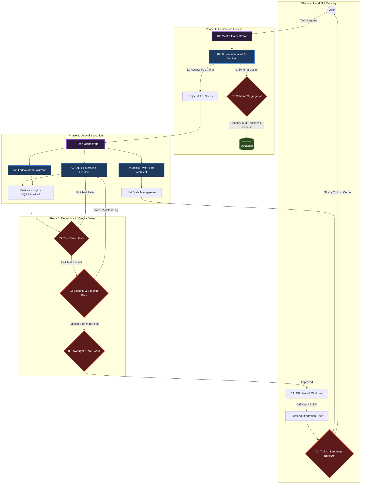

# 🚀 AI-Skills v2.0: The Autonomous Digital Agency

[Türkçe Dokümantasyon (README.md)](README.md)

This repository is a fully autonomous agent ecosystem that rejects standard, passive LLM prompt libraries. Instead, it features **decision-making agents, automated testing, sub-agent delegation, and deterministic quality gates.**

## 📊 Agent Topology & Deep Data Flow


## 📚 Comprehensive Documentation (English)
* 🏗️ [Architecture Anatomy (ARCHITECTURE.md)](docs/en/ARCHITECTURE.md)
* 🧠 [Core Principles (PRINCIPLES.md)](docs/en/PRINCIPLES.md)
* 🔄 [Autonomous Workflows (WORKFLOWS.md)](docs/en/WORKFLOWS.md)

## ⚙️ Installation
```bash
python3 scripts/build_cursor_rules.py
```
