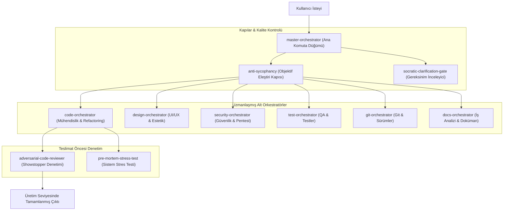

# 🧠 Evrensel AI Agent Yetenek & Kural Kütüphanesi

[English](README.md) | [Türkçe](README_TR.md)

[](LICENSE)
[](CONTRIBUTING.md)
[]()
[]()
[]()
[]()
[]()
[]()

> **Evrensel Açık Kaynak AI Agent Kütüphanesi**; **Antigravity (Gemini)**, **Cursor AI**, **Claude Code**, **GitHub Copilot**, **OpenAI Codex** ve **Windsurf** araçları için üretim seviyesi mühendislik yetenekleri, orkestratör agent'lar ve dalkavukluk önleyici (anti-sycophancy) eleştiri kuralları sunar.

---

## 🙏 Atıflar ve Teşekkürler (Acknowledgements & Credits)

Bu kütüphanenin geliştirilmesinde ilham veren ve zemin hazırlayan açık kaynak proje sahiplerine ve araştırmacılara derin teşekkürlerimizi sunarız:

- **[PatrickJS/awesome-cursorrules](https://github.com/PatrickJS/awesome-cursorrules)** - Cursor Rules ekosistemi ve anti-sycophancy kod disiplini standartları.
- **[0xcjl/anti-sycophancy](https://github.com/0xcjl/anti-sycophancy)** - 3 katmanlı anti-sycophancy savunması ve ArXiv *"Ask Don't Tell"* araştırması.
- **[addyosmani/agent-skills](https://github.com/addyosmani/agent-skills)** - Addy Osmani'nin üretim seviyesi mühendislik ilkeleri.
- **[anthropics/skills](https://github.com/anthropics/skills)** - Resmi Anthropic `SKILL.md` format standardı.
- **[SwePalm/socratic-skill](https://github.com/SwePalm/socratic-skill)** & **[m4vic/socratic](https://github.com/m4vic/socratic)** - Sokratik netleştirme kapısı.
- **[vlad-ko/claude-wizard](https://github.com/vlad-ko/claude-wizard)** - Hasmane kod incelemesi ve teslim öncesi showstopper denetimi.
- **[ColdIQ/ColdIQ-s-GTM-Skills](https://github.com/Cold-IQ/ColdIQ-s-GTM-Skills)** - Pre-Mortem sistem stres simülasyonu.

Tüm detaylı atıflar için bkz: **[CREDITS_TR.md](CREDITS_TR.md)** | **[CREDITS.md](CREDITS.md)**.

---

## 🏛️ Mimari & Orkestrasyon Akışı

Bu depo, alt orkestratörleri koordine eden ve tüm LLM araçlarında objektif kod disiplinini uygulayan bir **Master Orkestratör Motoru** içerir:



---

## 🚀 Hızlı Kurulum Rehberi

Etkileşimli kurulum sihirbazı ile tüm yetenekleri tek bir komutla yükleyin:

```bash
# 1. Depoyu klonlayın
git clone https://github.com/GktuOktay/ai-skills.git
cd ai-skills

# 2. Kurulum betiğini çalıştırın (Etkileşimli Dil Seçimi: English / Türkçe)
python setup.py

# Dilerseniz dil parametresi ile doğrudan çalıştırın:
python setup.py --lang tr
python setup.py --lang en
```

---

## 🤝 Katkıda Bulunma

Açık kaynak katkılarınızı bekliyoruz! Lütfen önce [Katkı Rehberi](CONTRIBUTING.md) ve [Topluluk Kurallarını](CODE_OF_CONDUCT.md) inceleyin.

---

## 📄 Lisans

Bu proje [MIT Lisansı](LICENSE) altında açık kaynaklıdır.
