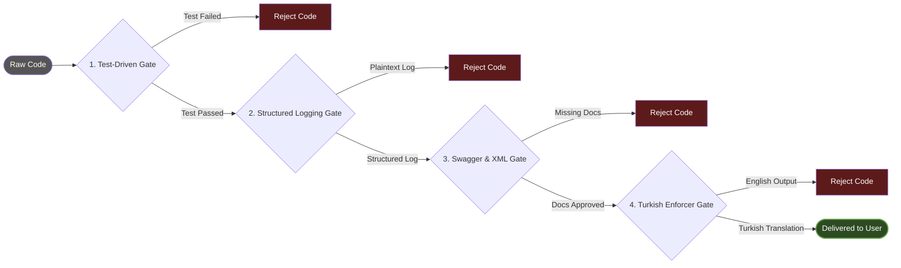

# 🏗️ Architecture Anatomy

## 01_orchestrators (Managers)
They do not write code; they plan and delegate. (e.g., Master Orchestrator, Code Orchestrator)

## 02_specialists (Expert Agents)
* **.NET Enterprise Architect:** C# 11+, CQRS, EF Core optimization.
* **Legacy Code Migrator:** Migrates Django -> .NET safely while adapting to Clean Architecture.
* **Mobile Swift/Flutter Architect:** State management and memory leak expert.

## 03_quality_gates (Deterministic Gates)
* **Test-Driven Gate:** Rejects code unless unit tests are written and pass.
* **Structured Logging & Audit Gate:** Enforces structured logs and prevents full payload DB logging.

## 🚥 Production Pipeline & Quality Gates
Uzmanların yazdığı kodlar, aşağıdaki deterministik kapılardan geçmeden ASLA size ulaşmaz.

