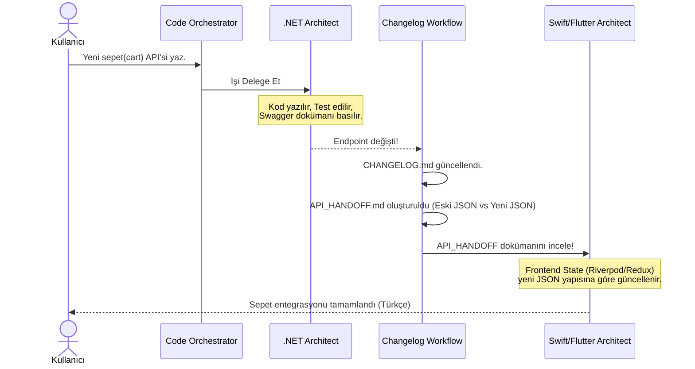

# 🔄 Autonomous Workflows (Autonomous Workflows)

Geliştirme sürecindeki hammaliye süreçlerini (Boilerplate yazımı, Dokümantasyon, Sürüm Yönetimi) ortadan kaldıran otomatize edilmiş işlem hatları.

## 1. Backend-to-Frontend Devir Teslimi (API Handoff)
Frontend ve Backend takımları (veya ajanları) arasındaki entegrasyon hatalarını sıfıra indirmek için tasarlanmıştır.

### Execution Algorithm:
1. **Trigger:** Code Orchestrator, Backend ajanının işini bitirdiğini tespit eder.
2. **Diff Analizi:** Git veya AST (Abstract Syntax Tree) üzerinden eski DTO ile yeni DTO arasındaki farklar (JSON diff) hesaplanır.
3. **Artifact Üretimi:** `API_HANDOFF.md` dosyası oluşturulur.

## ⏱️ API Devir-Teslim (Handoff) Sequence Diagram

## 2. Project Bootstrapping (Bootstrap)
CLI ortamında projelerin sıfırdan oluşturulması sürecini yönetir. Kullanıcı *"Yeni bir .NET projesi kur"* dediğinde arka planda çalışan süreç:

1. `dotnet new sln -n MyProject`
2. `dotnet new webapi -n MyProject.API`
3. `dotnet new classlib -n MyProject.Domain`
4. Proje referansları otonom olarak birbirine bağlanır (`dotnet add reference`).
5. Dockerfile ve `docker-compose.yml` CI/CD için anında üretilir.
