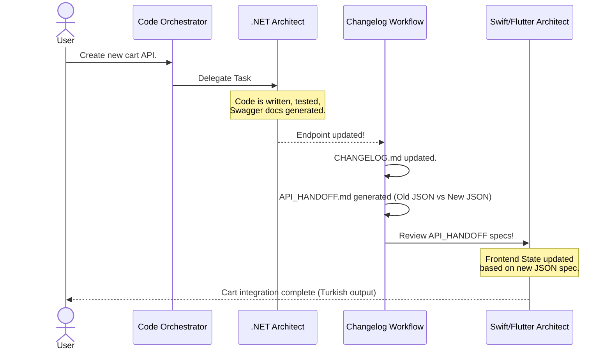

# 🔄 Autonomous Workflows

## 1. Backend-to-Frontend API Handoff
When a backend API changes, the agent autonomously generates `API_HANDOFF.md` detailing the Old vs. New JSON diff and specific instructions for the Frontend team.

## 2. Project Bootstrapping
The `project-bootstrap-orchestrator` autonomously runs CLI commands (`dotnet new`) to scaffold Clean Architecture folder structures.

## ⏱️ API Devir-Teslim (Handoff) Akış Şeması
Backend'in kodu bitirmesinden Frontend'e devrine kadar geçen otonom süre.

