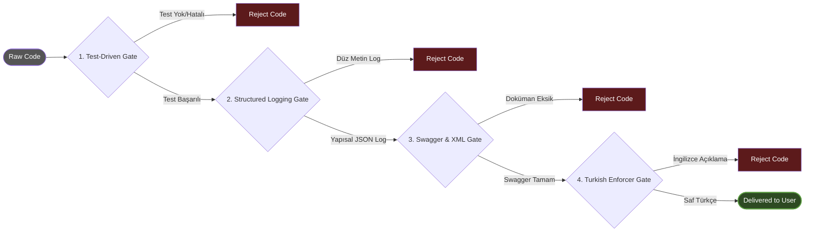

# 🏗️ Architecture Deep-Dive (Architecture Deep-Dive)

[🇹🇷 Türkçe Dokümantasyon (Turkish)](../../tr/core/ARCHITECTURE.md)

This document, `v2.0` Autonomous Agency ekosisteminin teknik katmanlarını, ajanlar arası iletişim protokollerini (Inter-Agent Communication) ve yetki devri (Delegation) süreçlerini mikroskobik düzeyde inceler.

## 1. Meta-Mimari: Çoklu Ajan Karar Ağacı
Sistem klasik bir "İstem -> Yanıt" (Prompt -> Completion) döngüsüyle çalışmaz. Bunun yerine **Stateful (Durum Korumalı) Yönlendirme Algoritması** kullanır. Abstract user requests (örn: "Build cart infrastructure"), Master Orchestrator tarafından bir AST (Abstract Syntax Tree) gibi parçalanır ve Node'lara (Ajanlara) dağıtılır.

### 01_orchestrators (Routing and Decision Layer)
Orchestrator'lar asla kaynak kodu doğrudan manipüle etmez. Görevleri şunlardır:
- **Context Boundary (Bağlam Sınırı) Çizmek:** Hangi ajanın hangi klasörlerde yetkisi olduğunu belirler.
- **Fail-Fast Denetimi:** If expert code fails kod kalite kapısından geçemezse, işlemi derhal durdurur ve geri bildirim döngüsünü (Feedback Loop) başlatır.
- **Dependency Graph (Bağımlılık Grafiği) Yönetimi:** Önce veritabanı şemasının, sonra backend API'nin, en son mobil arayüzün yazılması gerektiğine karar veren sıralı asenkron akışı yönetir.

### 02_specialists (Vertical Expertise & Execution)
Bu katman, spesifik teknolojilerde derinlemesine eğitilmiş (Fine-tuned) prompt setleridir.
* **.NET Enterprise Architect:** `DbContext` üzerinde `AsNoTracking()` uygulamasını zorunlu kılar. `N+1` select hatalarını önceden tespit etmek için LINQ sorgularını statik analiz vizyonuyla inceler. YARP veya Ocelot gateway yapılandırmalarında uzmanlaşmıştır.
* **Mobile Swift/Flutter Architect:** Arayüz çizerken bellek sızıntılarını (Memory Leaks - Retain Cycles) önlemek için `weak self` (Swift) veya uygun `dispose` (Flutter) metodolojilerini zorla uygular.
* **Legacy Code Migrator:** Dönüşüm esnasında (Örn: Python -> C#) kaynak kodun anti-pattern'lerini hedef dile taşımaz. "Lift and Shift" yerine "Refactor and Shift" mimarisini benimser.

## 2. Deterministic Quality Gates (Quality Gates - Katman 03)
Üretilen kod parçacıkları, kullanıcıya sunulmadan önce "Hard-Constraint" (Kesin Kural) kapılarından geçer. Eğer kod aşağıdaki şartları sağlamazsa ajan tarafından reddedilir:
1. **TDD (Test-Driven Development) Kapısı:** Yazılan her Controller veya Manager sınıfı için xUnit/NUnit testlerinin varlığı kontrol edilir.
2. **Audit & Structured Logging Kapısı:** `ILogger` kullanımlarında metin tabanlı (String interpolation) loglama yasaktır. Tamamen JSON veya Semantic (Yapısal) Loglama kurgusu aranır. Kullanıcı şifreleri, kredi kartı gibi PII/PCI verilerinin log payload'unda maskelendiğinden emin olunur.
3. **Turkish Language Enforcer:** Kodun kendisi, değişken adları, veritabanı şemaları tamamen İngilizce (Evrensel standart) kalmak zorundadır; ancak kullanıcının göreceği terminal çıktıları, dokümantasyonlar ve Commit mesajları saf Türkçe olmalıdır.

## 🚥 Üretim Bandı ve Kalite Kapıları (Quality Pipeline)

