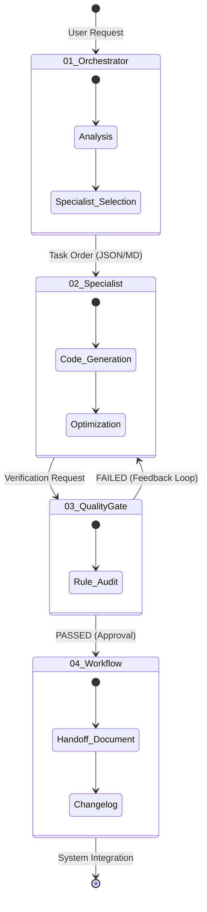

# ⚖️ Hierarchy & Delegation Protocol

[🇹🇷 Türkçe Dokümantasyon (Turkish)](../../tr/core/HIERARCHY_PROTOCOL.md)

This document defines the strict communication boundaries and constraints between departments in the `v2.0` Autonomous Agency architecture. The system relies on deterministic rules; agents are not granted uncontrolled autonomy.

## 1. Inter-Departmental Rules

### Rule 1: Orchestrators Cannot Write Code
No agent in the `01_orchestrators` layer has the authority to directly write or manipulate source code.
- **Allowed:** Creating business plans, making architectural decisions, and delegating tasks to `02_specialists`.
- **Prohibited:** Directly modifying `.cs` or `.ts` files inside the IDE.

### Rule 2: Specialists Cannot Bypass Quality Gates
Agents in the `02_specialists` layer cannot deliver their output directly to the user.
- **Mandatory:** Every piece of code must pass through the relevant `03_quality_gates` (e.g., TDD, Structured Logging, Swagger Docs).
- **Violation:** If code fails a gate, it is bounced back to the specialist via a Feedback Loop. Delivery is blocked until the code is fixed.

### Rule 3: Quality Gates Do Not Fix Code (Read-Only)
The `03_quality_gates` layer acts purely as an auditor.
- **Allowed:** Reading code, verifying it against standards, and emitting a Passed/Failed signal.
- **Prohibited:** A Gate agent cannot fix the code itself. The responsibility for fixing code remains strictly with the generating `02_specialists`.

### Rule 4: Capabilities (Tools) Do Not Make Decisions
Tools in `05_capabilities` (e.g., PDF parsers, Graphify) are passive utilities.
- **Constraint:** They cannot make autonomous decisions. They are only triggered by an Orchestrator or Specialist and return raw processed data. They have no authority to interpret results.

## 2. Delegation Lifecycle

