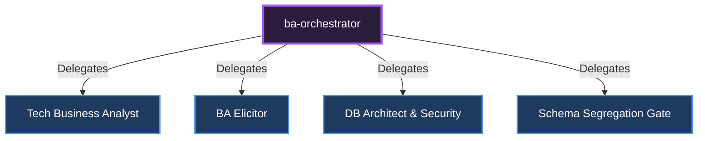

# 🎼 Business Analysis Orchestrator

**Role:** Gathers business requirements, designs DB schemas, and outputs technical specifications.

## Sub-Specialists and Delegation Diagram

---
*This document was autonomously generated.*
