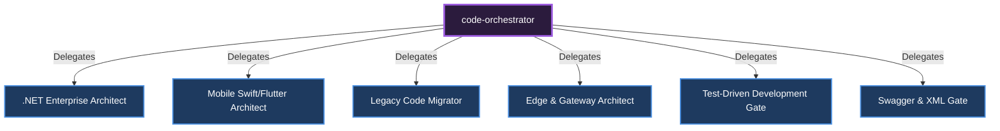

# 🎼 Code Orchestrator

**Role:** Responsible for software architecture, code generation, and orchestrating platform-specific specialists.

## Sub-Specialists and Delegation Diagram

---
*This document was autonomously generated.*
