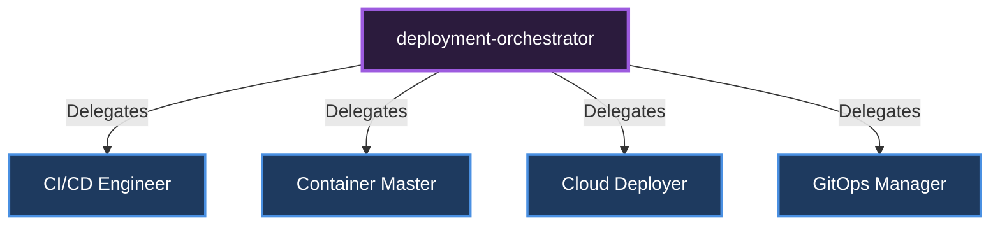

# 🎼 Deployment Orchestrator

[🇹🇷 Türkçe Dokümantasyon (Turkish)](../../tr/orchestrators/deployment-orchestrator.md)

**Role:** Manages code deployment, containerization, and cloud infrastructure.

## Sub-Specialists and Delegation Diagram

---
*This document was autonomously generated.*
