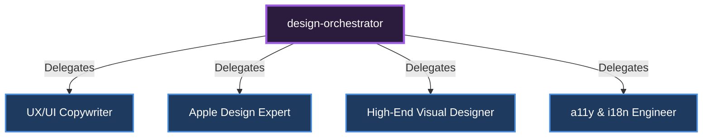

# 🎼 Design Orchestrator

[🇹🇷 Türkçe Dokümantasyon (Turkish)](../../tr/orchestrators/design-orchestrator.md)

**Role:** Manages visual quality, copywriting, and design system (Brandkit) construction.

## Sub-Specialists and Delegation Diagram

---
*This document was autonomously generated.*
