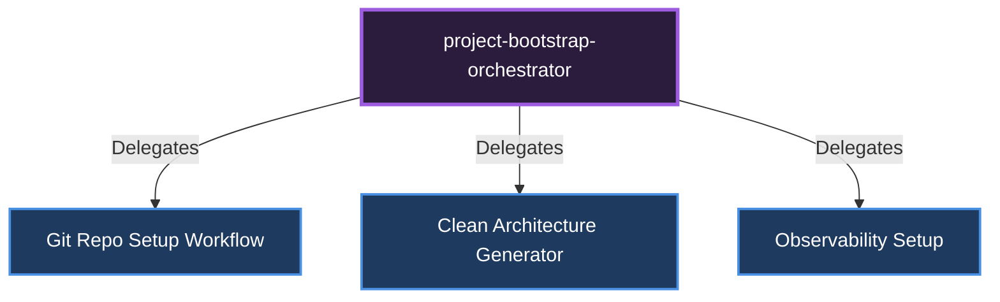

# 🎼 Project Bootstrap Orchestrator

**Role:** Scaffolds from-scratch projects, boilerplate code, and architecture via CLI.

## Sub-Specialists and Delegation Diagram

---
*This document was autonomously generated.*
