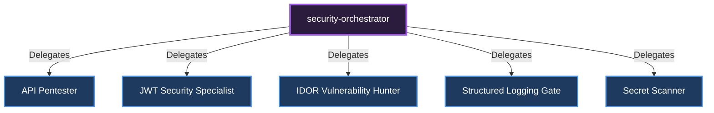

# 🎼 Security Orchestrator

[🇹🇷 Türkçe Dokümantasyon (Turkish)](../../tr/orchestrators/security-orchestrator.md)

**Role:** Manages system vulnerabilities (OWASP), penetration tests, and audit processes.

## Sub-Specialists and Delegation Diagram

---
*This document was autonomously generated.*
