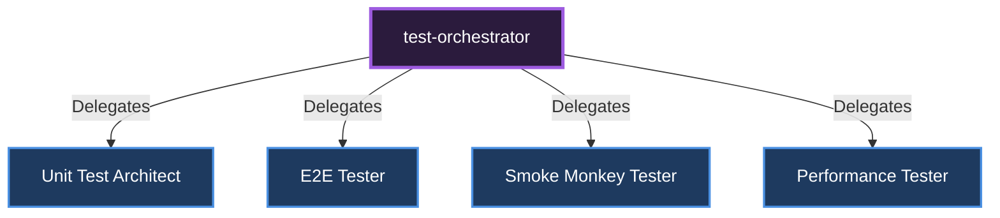

# 🎼 Test Orchestrator

[🇹🇷 Türkçe Dokümantasyon (Turkish)](../../tr/orchestrators/test-orchestrator.md)

**Role:** Coordinates End-to-End (E2E), Unit, and Smoke tests.

## Sub-Specialists and Delegation Diagram

---
*This document was autonomously generated.*
