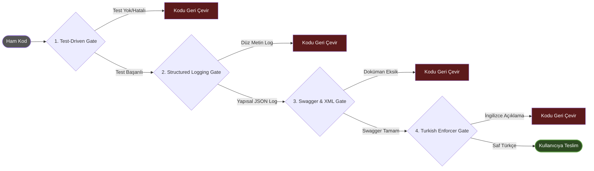

# 🏗️ Sistemin Anatomisi (Architecture)

## 01_orchestrators (Yöneticiler)
Kod yazmaz, işi planlar ve delege eder. (Örn: Master Orchestrator, Code Orchestrator)

## 02_specialists (Uzman Ajanlar)
* **.NET Enterprise Architect:** C# 11+, CQRS, EF Core.
* **Legacy Code Migrator:** Django -> .NET veya Vue -> React göçlerini mimariye uygun yapar.
* **Mobile Swift/Flutter Architect:** Native (TCA/MVVM) ve Cross-platform (Riverpod) uzmanı.

## 03_quality_gates (Kalite Kapıları)
* **Turkish Language Enforcer:** Çıktının her zaman Türkçe olmasını sağlar.
* **Test-Driven Gate:** Test yazılıp başarılı olmadan kodu kabul etmez.
* **Structured Logging & Audit Gate:** Tam Payload loglanmasını engeller, ActionType loglamayı zorunlu tutar.

## 🚥 Üretim Bandı ve Kalite Kapıları (Quality Pipeline)
Uzmanların yazdığı kodlar, aşağıdaki deterministik kapılardan geçmeden ASLA size ulaşmaz.

