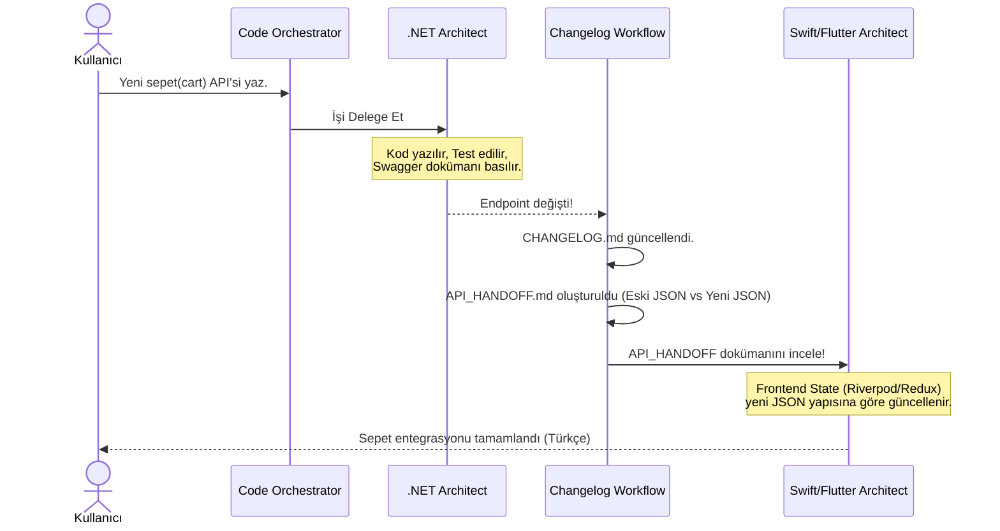

# 🔄 Otonom İş Akışları

## 1. Backend-to-Frontend Devir Teslimi (API Handoff)
Backend'de bir API değiştiğinde ajan otomatik olarak `API_HANDOFF.md` oluşturur. Eski JSON ve Yeni JSON farklarını (Diff) ve Frontend'in ne yapması gerektiğini yazar.

## 2. Otonom Proje Kurulumu
`project-bootstrap-orchestrator` ile klasör mimarisi, `dotnet new` komutları ve temel ayarlar CLI üzerinden otomatik kurulur.

## ⏱️ API Devir-Teslim (Handoff) Akış Şeması
Backend'in kodu bitirmesinden Frontend'e devrine kadar geçen otonom süre.

