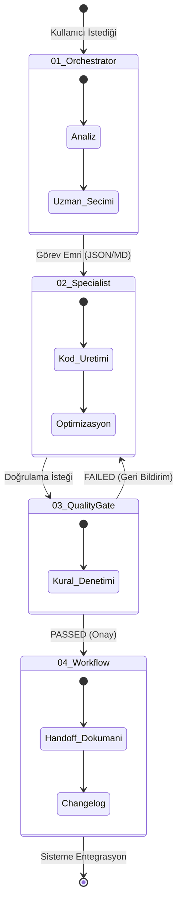

# ⚖️ Hiyerarşi ve Yetki Devri Protokolü (Hierarchy & Delegation Protocol)

[🇺🇸 English Documentation](../../en/core/HIERARCHY_PROTOCOL.md)

Bu doküman, `v2.0` Otonom Ajans mimarisindeki departmanların birbiriyle iletişim sınırlarını ve katı (strict) kısıtlamalarını tanımlar. Sistem bilgiye ve deterministik kurallara dayanır, ajanların otonomisine kontrolsüz izin verilmez.

## 1. Departmanlar Arası İletişim Kuralları (Inter-Departmental Rules)

### Kural 1: Orkestratörler Kod Yazamaz
`01_orchestrators` katmanındaki hiçbir ajan (Örn: Code Orchestrator) doğrudan kaynak kod yazma veya manipüle etme yetkisine sahip değildir. 
- **İzin Verilen:** İş planı çıkarmak, mimari karar almak, görevi ilgili uzmana (`02_specialists`) delege etmek (Yetki Devri).
- **Yasaklanan:** IDE içinde doğrudan `.cs` veya `.ts` dosyalarına müdahale etmek.

### Kural 2: Uzmanlar Kapıları Atlayamaz (No Bypass)
`02_specialists` katmanındaki ajanlar (Örn: .NET Enterprise Architect), ürettikleri kodu doğrudan kullanıcıya (User) sunamaz.
- **Zorunluluk:** Üretilen her kod parçası veya mimari, ilgili `03_quality_gates` (Kalite Kapıları) tarafından denetlenmek zorundadır (TDD, Yapısal Loglama, Swagger).
- **İhlal Durumu:** Kapıdan geçemeyen kod, uzmana hata logu ile birlikte (Feedback Loop) geri döner. Uzman kodu düzeltene kadar teslimat yapılamaz.

### Kural 3: Kalite Kapıları Kodu Düzeltmez (Read-Only Verification)
`03_quality_gates` katmanı sadece bir yargıçtır (Auditor).
- **İzin Verilen:** Kodu okumak, standartlara (Örn: Türkçe Dil Zorunluluğu) uyup uymadığını denetlemek ve Passed/Failed sinyali üretmek.
- **Yasaklanan:** Hatalı gördüğü kodu kendisi (Gate ajanı) düzeltemez. Düzeltme sorumluluğu her zaman kodu üreten uzmana (`02_specialists`) aittir.

### Kural 4: Araçlar (Capabilities) Karar Alamaz
`05_capabilities` (Örn: PDF ayrıştırıcı, Graphify) sadece pasif araçlardır.
- **Kısıtlama:** Kendi başlarına otonom kararlar alamazlar. Sadece bir Uzman veya Orkestratör tarafından tetiklenirler ve işlenmiş saf (raw) datayı geri dönerler. Yorumlama yetkileri yoktur.

### Kural 5: MCP Konnektörleri Güvenli Alan Dışına Çıkamaz (Sandboxing)
`06_mcp_connectors` katmanı, doğrudan veritabanı şeması veya GitHub loglarını okur ancak otonom olarak (insan onayı olmadan) yazma/silme (`DROP TABLE`) işlemi yapamaz. Mutlak Read-Only veya Onaylı-Write kurallarına tabidir.

## 2. Yetki Devri (Delegation) Yaşam Döngüsü

