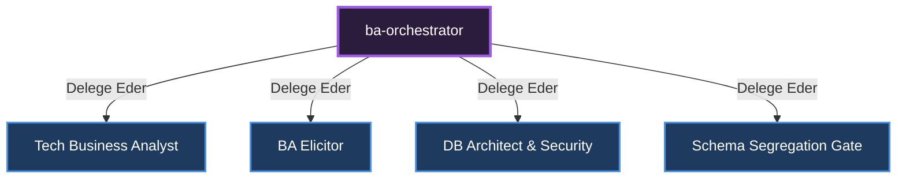

# 🎼 Business Analysis (BA) Orchestrator

[🇺🇸 English Documentation](../../en/orchestrators/ba-orchestrator.md)

**Görevi:** İş gereksinimlerini toplar, veritabanı şemalarını çizer ve projeyi teknik spesifikasyonlara döker.

## Alt Uzmanlar ve Yetki Dağılımı Diyagramı

---
*Bu doküman otonom olarak üretilmiştir.*
