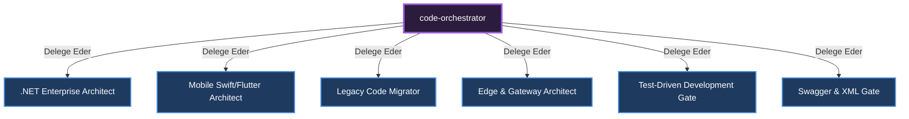

# 🎼 Code Orchestrator (Yazılım Geliştirme Yöneticisi)

**Görevi:** Yazılım mimarisi, kod yazımı ve platform bazlı uzmanların (Backend/Frontend) orkestrasyonundan sorumludur.

## Alt Uzmanlar ve Yetki Dağılımı Diyagramı

---
*Bu doküman otonom olarak üretilmiştir.*
