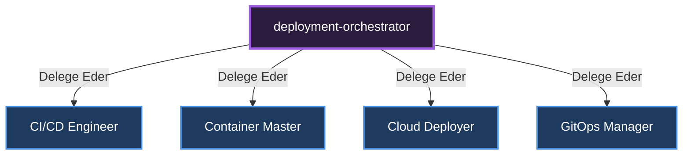

# 🎼 Deployment & CI/CD Orchestrator

[🇺🇸 English Documentation](../../en/orchestrators/deployment-orchestrator.md)

**Görevi:** Kodun canlıya alınması, konteynerleştirme ve bulut altyapı süreçlerini yönetir.

## Alt Uzmanlar ve Yetki Dağılımı Diyagramı

---
*Bu doküman otonom olarak üretilmiştir.*
