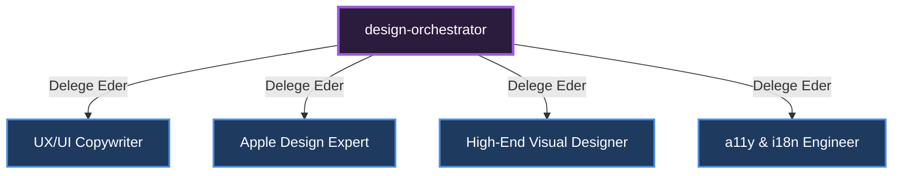

# 🎼 Design Orchestrator (Tasarım ve UI/UX Yöneticisi)

**Görevi:** Görsel kalite, metin yazarlığı ve tasarım sistemleri (Brandkit) inşasını yönetir.

## Alt Uzmanlar ve Yetki Dağılımı Diyagramı

---
*Bu doküman otonom olarak üretilmiştir.*
