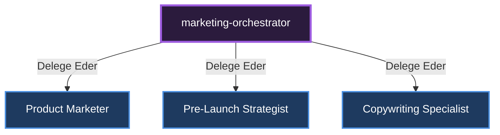

# 🎼 Marketing Orchestrator (Pazarlama Yöneticisi)

[🇺🇸 English Documentation](../../en/orchestrators/marketing-orchestrator.md)

**Görevi:** Ürünün lansman öncesi pazarlama stratejilerini, kopyalarını ve marka iletişimini yönetir.

## Alt Uzmanlar ve Yetki Dağılımı Diyagramı

---
*Bu doküman otonom olarak üretilmiştir.*
