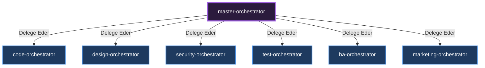

# 🎼 Master Orchestrator (Genel Yönlendirici)

[🇺🇸 English Documentation](../../en/orchestrators/master-orchestrator.md)

**Görevi:** Kullanıcıdan gelen ham talebi alır ve hangi alt orkestratörün (Departmanın) devreye gireceğine karar verir.

## Alt Uzmanlar ve Yetki Dağılımı Diyagramı

---
*Bu doküman otonom olarak üretilmiştir.*
