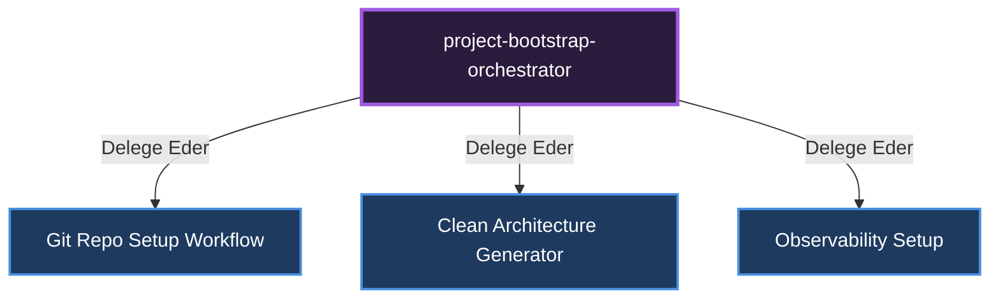

# 🎼 Project Bootstrap (Proje Başlatma Yöneticisi)

**Görevi:** Sıfırdan projelerin (CLI üzerinden) klasör yapısını, boilerplate kodlarını ve mimarisini kurar.

## Alt Uzmanlar ve Yetki Dağılımı Diyagramı

---
*Bu doküman otonom olarak üretilmiştir.*
