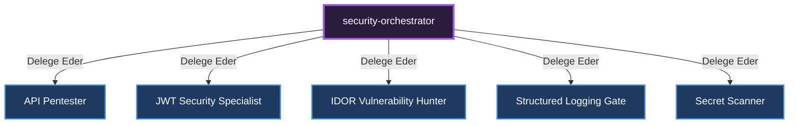

# 🎼 Security Orchestrator (Güvenlik Yöneticisi)

[🇺🇸 English Documentation](../../en/orchestrators/security-orchestrator.md)

**Görevi:** Sistemdeki güvenlik zafiyetlerini (OWASP), penetrasyon testlerini ve audit süreçlerini yönetir.

## Alt Uzmanlar ve Yetki Dağılımı Diyagramı

---
*Bu doküman otonom olarak üretilmiştir.*
