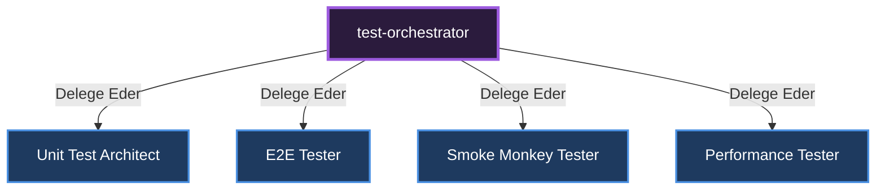

# 🎼 Test Orchestrator (QA Yöneticisi)

**Görevi:** Uçtan uca testleri (E2E), birim testleri (Unit) ve duman testlerini (Smoke) koordine eder.

## Alt Uzmanlar ve Yetki Dağılımı Diyagramı

---
*Bu doküman otonom olarak üretilmiştir.*
